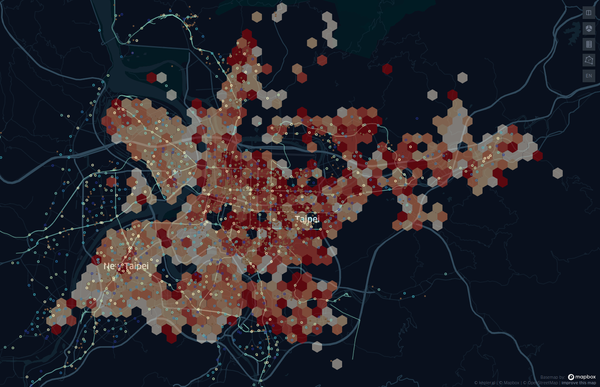

# 大台北租屋市場調查

原本想要自己用 kepler.gl 架地圖，後來官方網站修好了，所以就直接使用啦～

本專案源自源自 g0v.tw 社群的 Rentea 社群（拗口），
有空也歡迎來逛逛 [Rentea 社群共筆](https://g0v.hackmd.io/@ddio/rentea-tue)

前請先找一個網路不花錢的地方，再打開網站，因為一開就會花掉 40MB 呦 XD

試玩網址： https://bit.ly/3aQybWo

## 基本介紹

kepler.gl 是 Uber 做的地圖視覺話工具，可以快速彙整（aggregate）大量資料，
將結果呈現到地圖上。

試玩網址中，包含 2020 刊載 591 上，大台北週邊的所有物件，地區包含：

1. 北投以外的台北市
2. 台北市週邊的新北各區，包含：三重、中和、永和、板橋、板橋、蘆洲、汐止

## 使用方式

1. 網頁打開後，請先將地圖移至台灣，並在左側選單，找到過濾器（Filters）。
2. 在過濾器中，選擇想要搜尋的物件類型，例如套房
3. 回到圖層（Layers），即可選擇有興趣看的資料

詳細使用說明，請參閱 kepler.gl [官方文件](https://docs.kepler.gl/docs/user-guides)

## 資料來源

1. Ubike 站點、捷運路線：[政府開放資料平台](https://data.gov.tw/)
2. 雙北咖啡店：[Cafe Nomad API](https://cafenomad.tw/developers/docs/v1.2)
3. 租屋資訊：[開放台灣租屋資料](https://rentalhouse.g0v.ddio.io)

這個 git 裡也有整理好的 2019 資料，詳見 data 資料夾，歡迎手動匯入 kepler 玩玩～

